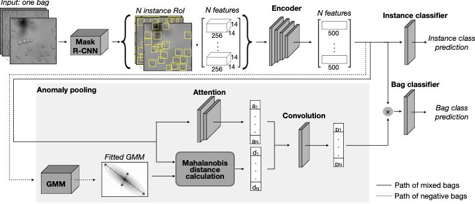

# Anomaly-aware MIL
This is the PyTorch implementation of anomaly-aware multiple instance learning for rare anemia disorder classification.
For more details please read the paper 	[Anomaly-aware multiple instance learning for rare anemia disorder classification](https://www.example.com). 
This is the result of a team work contributed by Salome Kazeminia, Ario Sadafi, Asya Makhro, Anna Bogdanova, Shadi Albarqouni , and Carsten Marr.

# Model architecture 
This model architecture contains 4 parts:
1. Mask-R CNN: an object detector to detect cells in each sample.
2. Deep encoder: a feature extractor with 3 convolution layers.
3. Attention mechanism: a two linear layer to estimate the attention score for each instance
4. Anomaly scoring: the Mahalanobis distance of each instance to the gaussian mixture model fitted on healthy data distribution. 



# Requirements
The code is compatible with pytorch 1.10.0.

# Data
We used our private dataset. Therefore, to use this model for your target domain you need to manipulate DataLoader.py and HDataLoader.py files compatible with your data structure.
Our dataset contains 3630 microscopic images of blood samples taken from 71 patients at different times and under variant treatments. 
The distribution of data in different classes is as follows: Sickle Cell Disease (SCD, 13 patients, 170 samples), Thalassemia (Thal, 3 patients, 25 samples), Hereditary Xerocytosis (Xero, 9 patients, 56 samples), and Hereditary Spherocytosis (HS, 13 patients, 89 samples). 
Also, we have a healthy control group (33 individuals, 181 samples), used as negative bags.

# Execution
## train 
Run:
```trainMIL.py <fold_number><model_name><run_number>```

Please note!
All three arguments are necessary due to our data structure and can be removed from your code, depending on using k-fold crossvalidation, models you like to execute in parallel, and number of runs you need to estimate an average performance.
When training is accomplished the learned parameters are stored at Model repository.

## test
Run: 
```testMIL.py```

# Acknowledgement
The present contribution is supported by the Helmholtz Association under the joint research school “Munich School for Data Science - MUDS".
Patients previously diagnosed with hereditary spherocytosis were enrolled in the CoMMiTMenT-study (http://www.rare-anaemia.eu/). This study was approved by the Medical Ethical Research Board of the University Medical Center Utrecht, the Netherlands, under reference code 15/426M and by the Ethical Committee of Clinical Investigations of Hospital Clinic, Spain (IDIBAPS) under reference code 2013/8436. Genetic cause of the disease was identified by the research group of Richard van Wijk, University Medical Center Utrecht, the Netherlands. The healthy subjects study was approved by the ethics committees of the University of Heidelberg, Germany, (S-066/2018) and of the University of Berne, Switzerland (2018-01766), and was performed according to the Declaration of Helsinki.
